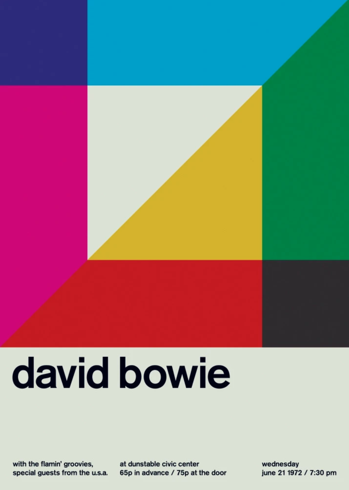
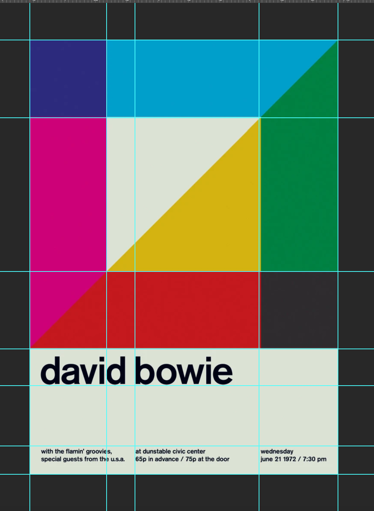
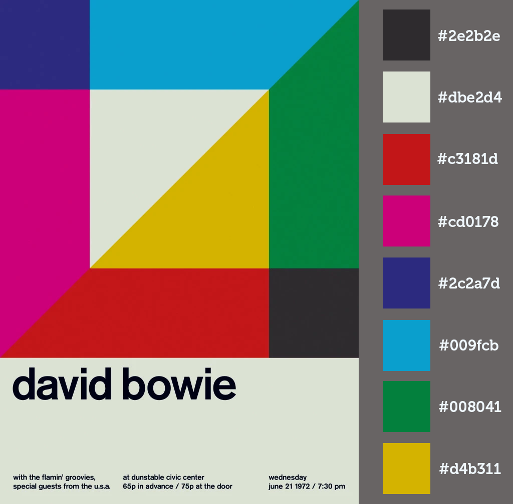
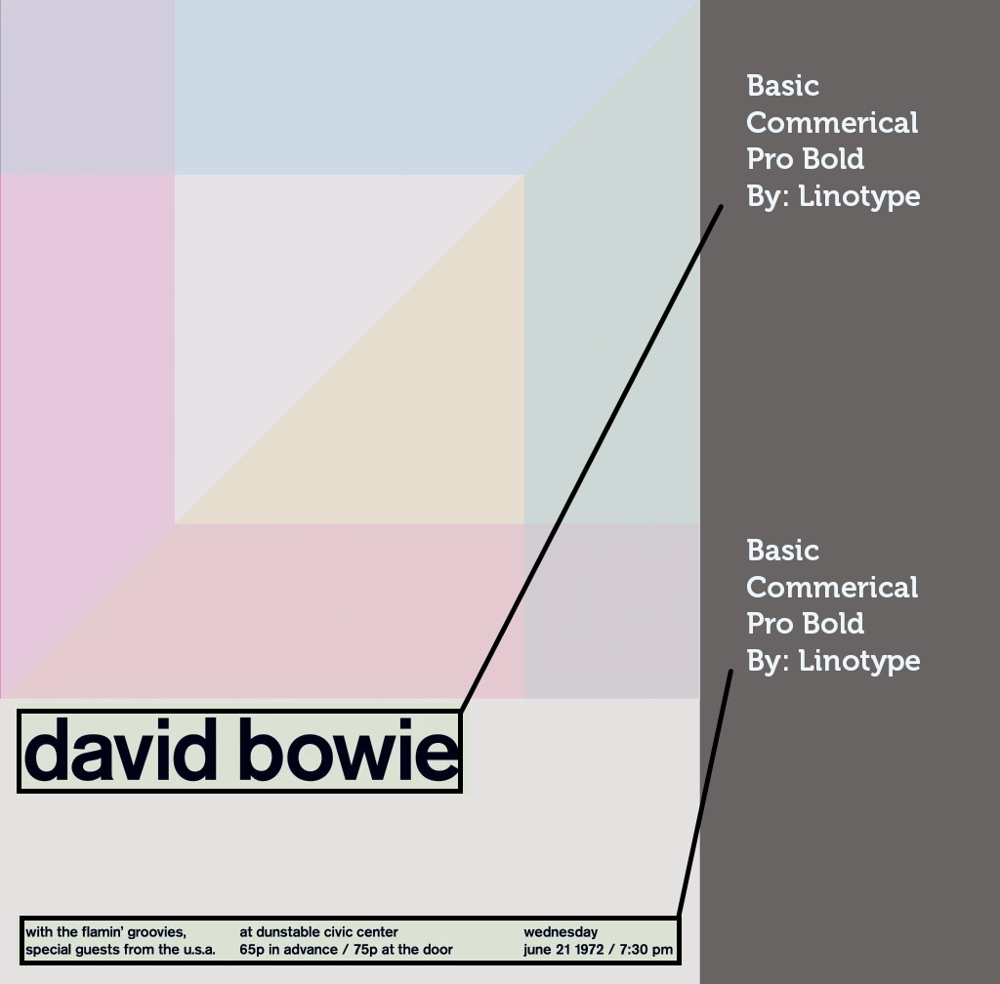
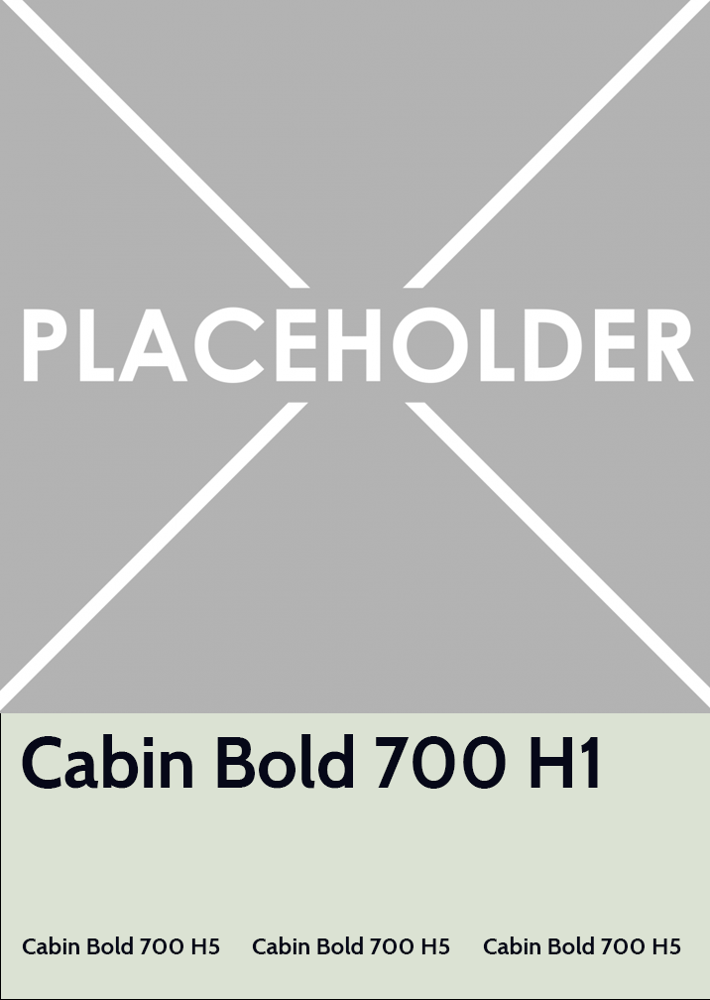

# Swiss Poster
<!-- A one sentence description of the project or assignment -->
This is a project that explores the design and development process of recreating a Swiss Poster.

<!-- It is good practice to add an about or summary -->
## About
This website allowed me to practice establishing a reponsive design grid using css and javascript. It contains an interactive component where if you click anywhere on the screen, the main design will change. There are 3 variations of the main design and they were all created using p5.js.
<!-- Any knowledge or tools you will need before hand -->
### Prerequisites

1. A text editor or Integrated Development Environment (IDE)- preferably [VS Code](https://code.visualstudio.com/) to view code on your computer if you wish to download.

<!-- any installation needs should be defined -->
<!-- Write instructions on how to start working on your project -->
<!-- Notes about the deployment -->
## Deployment

This project is hosted on Glitch. You can visit the rendered website [here](https://jlizardo019-swissposter.glitch.me/)

I also created an alternate site using text promoting the ITP Spring Show 2020 [here](https://itpspringshow.glitch.me/)

### Built with

* [VS Code](https://code.visualstudio.com/)
* [Github](https://github.com)
* [Glitch](https://glitch.com)

### Process

1. I analyzed the grid of the poster I chose and marked the layout using guidelines in Adobe Photoshop.

2. Next, I established the color palette used in the poster and their coresponding hex values.

3. Using the website WhatTheFont!, I identified the fonts used in the poster. I ended up using the font Cabin by Google Fonts in my design since Basic Commercial Pro Bold is not free. They are very similar typefaces.

4. I established my wireframe before moving on to coding.

5. I created the main block design using p5.js and added the interactive component of using the mousePressed() function to cycle through variations of the block design.

6. I set up my my html and css, first working on the desktop version and then adding the additional media queries of mobile and tablet.

7. I tried creating an alternate web page using ITP Spring Show 2020 content [here](https://itpspringshow.glitch.me/)

8. I deployed both websites on Glitch.

<!--For more details about the creative process of this website development, visit my [blog] (https://julielizardo.com/)-->

## License
Please reach out if you would like to fork this project or contribute to development

## Author

* [Julie Lizardo](https://www.linkedin.com/in/julie-lizardo/)  -- [Creative Engineer](https://julielizardo.com/)

<!-- thank and reference all the things that made your project happen -->
## References

* [DuckDuckGo](https://duckduckgo.com/?q=swiss+poster+design&t=ffab&iax=images&ia=images&iai=http%3A%2F%2Fwww.fevte.com%2Fdata%2Fattachment%2Fportal%2F201303%2F27%2F215720frffkgfkzgszpzb8.jpg) to search for swiss poster images and gain inspiration
* [WhatTheFont!](https://www.myfonts.com/WhatTheFont/) to help me identify fonts used in poster
* [Adobe Photoshop](https://www.adobe.com/products/photoshopfamily.html) to create style guides and wireframes
